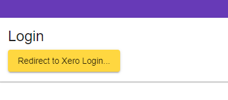
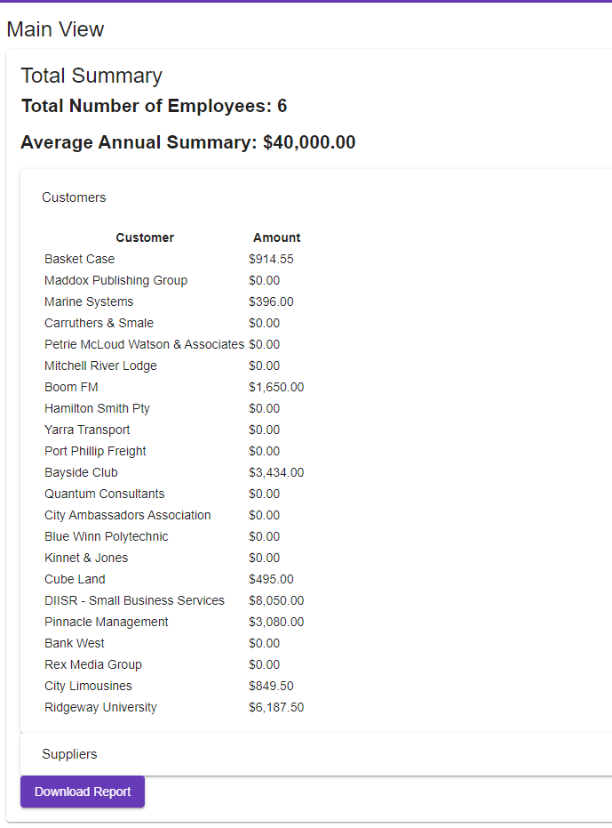

# Grow-Xero [Grow]
Grow Xero programming task
## Overview
Sample view of Login

Sample View of Dashboard

## Development Guidelines
### Local Development
#### Application
Grow-Xero consists of two modules webapp (Angular front-end) and a backend Spring boot application

Location of modules
- grow-xero-frontend, src/webapp
- grow-xero-backend, src/main/java/au/com/deep/grow

The following respective default ports are;
- grow-xero-backend - **:8080**

## Project
### Building Project
Building the whole module using the gradle command;
`./gradlew clean build`

#### Dealer-UI
To install node modules, navigate to package.json directory level and execute
`npm install`

To start the frontend application
`ng serve`
`npm start`

### TODO
- Download file capability - CSV
- (Minor) Refresh Tokens
- (Minor) Aesthetics
- (Minor) Permissions
- (Minor) Backend Security / Validation
